<div align="center">

  <!-- ═══════════════════════════════════════════════════ -->
  <!-- ⚡ ANIMATED CUSTOM SVG HEADER                      -->
  <!-- ═══════════════════════════════════════════════════ -->

  <a href="https://github.com/simply1git">
    
  </a>

  <br/>

  <!-- ═══════════════════════════════════════════════════ -->
  <!-- SOCIAL DOCK — MINIMAL NEON ACCENT                  -->
  <!-- ═══════════════════════════════════════════════════ -->

  <a href="https://github.com/simply1git"></a>&nbsp;
  <a href="https://linkedin.com/in/samartha-hm"></a>&nbsp;
  <a href="mailto:samarthahm@gmail.com"></a>&nbsp;
  <a href="https://samartha-hm.github.io"></a>&nbsp;
  

</div>

<!-- ═══════════════════════════════════════════════════════════ -->


<br/>

<!-- ═══════════════════════════════════════════════════════════ -->
<!-- 💀 ABOUT — TERMINAL AESTHETIC                              -->
<!-- ═══════════════════════════════════════════════════════════ -->

```
 ╔══════════════════════════════════════════════════════════════════════════╗
 ║                                                                        ║
 ║   > whoami                                                             ║
 ║                                                                        ║
 ║   Full-Stack Software Architect & AI Systems Engineer from India 🇮🇳    ║
 ║   Building high-throughput distributed systems, real-time WebSocket     ║
 ║   platforms, autonomous AI agents, and computer vision pipelines.       ║
 ║                                                                        ║
 ║   I don't build demos — I ship production systems that scale.          ║
 ║                                                                        ║
 ║   > cat /etc/focus                                                     ║
 ║                                                                        ║
 ║   ▸ Autonomous AI Agents & Multi-Modal Pipelines                       ║
 ║   ▸ Lossless Cloud Storage Streaming Engines                           ║
 ║   ▸ Real-Time Collaborative Developer Platforms                        ║
 ║   ▸ Zero-Latency WebRTC & WebSocket Architectures                     ║
 ║                                                                        ║
 ╚══════════════════════════════════════════════════════════════════════════╝
```

<br/>


<br/>

<!-- ═══════════════════════════════════════════════════════════ -->
<!-- ⚙️ TECH ARSENAL — NEON GRID                                -->
<!-- ═══════════════════════════════════════════════════════════ -->

<h3 align="center">
  
  &nbsp; TECH ARSENAL
</h3>

<div align="center">

<table>
  <tr>
    <td align="center" width="110"><b>⚡ Core</b></td>
    <td align="center">
      
    </td>
  </tr>
  <tr>
    <td align="center" width="110"><b>🏗️ Stack</b></td>
    <td align="center">
      
    </td>
  </tr>
  <tr>
    <td align="center" width="110"><b>🧠 AI/ML</b></td>
    <td align="center">
      
    </td>
  </tr>
  <tr>
    <td align="center" width="110"><b>💾 Data</b></td>
    <td align="center">
      
    </td>
  </tr>
  <tr>
    <td align="center" width="110"><b>☁️ Infra</b></td>
    <td align="center">
      
    </td>
  </tr>
</table>

</div>

<br/>


<br/>

<!-- ═══════════════════════════════════════════════════════════ -->
<!-- 📊 METRICS — DARK TELEMETRY DASHBOARD                      -->
<!-- ═══════════════════════════════════════════════════════════ -->

<h3 align="center">
  
  &nbsp; SYSTEM METRICS
</h3>

<div align="center">

  <!-- Stats + Streak side by side -->
  <a href="https://github.com/simply1git">
    
  </a>
  <a href="https://github.com/simply1git">
    
  </a>

  <br/><br/>

  <!-- Languages + Trophies -->
  <a href="https://github.com/simply1git">
    
  </a>
  <a href="https://github.com/simply1git">
    
  </a>

  <br/><br/>

  <!-- Activity Graph — full width -->
  <a href="https://github.com/simply1git">
    <picture>
      <source media="(prefers-color-scheme: dark)" srcset="https://github-readme-activity-graph.vercel.app/graph?username=simply1git&bg_color=0a0e17&color=94a3b8&line=00f2fe&point=7c3aed&area=true&area_color=00f2fe&hide_border=true&custom_title=CONTRIBUTION%20TELEMETRY"/>
      
    </picture>
  </a>

</div>

<br/>


<br/>

<!-- ═══════════════════════════════════════════════════════════ -->
<!-- 🚀 FEATURED PROJECTS — CARD LAYOUT                        -->
<!-- ═══════════════════════════════════════════════════════════ -->

<h3 align="center">
  
  &nbsp; DEPLOYED SYSTEMS
</h3>

<div align="center">
<table>
<tr>
<td width="50%" valign="top">

### [`⚡ SyncPadIO`](https://github.com/simply1git/SyncPadIO)
> **Real-Time Collaborative Workspace**

Zero-latency markdown & code scratchpad with WebSocket room synchronization, differential state delta merging, and offline persistence.

`TypeScript` `React` `WebSockets` `Node.js`

</td>
<td width="50%" valign="top">

### [`📹 YotuDrive`](https://github.com/simply1git/yotudrive)
> **Lossless Infinite Cloud Storage**

Breakthrough engine converting arbitrary binary payloads into high-density lossless video streams — unlimited free cloud storage.

`Python` `OpenCV` `FastAPI` `FFmpeg`

</td>
</tr>
<tr>
<td width="50%" valign="top">

### [`🤖 SimplyYTR`](https://github.com/simply1git/simplyytr)
> **Autonomous Content Engine**

End-to-end media bot: parses trends, writes scripts, generates synthetic voiceover, stitches dynamic video reels, handles scheduled uploads.

`Python` `Automation` `REST APIs`

</td>
<td width="50%" valign="top">

### [`🛠️ ToolsPage`](https://github.com/simply1git/toolspage)
> **Zero-Dependency Dev Suite**

High-perf developer utility platform: code formatters, encoder/decoders, crypto hash engines, client-side converters. Pure vanilla JS.

`JavaScript` `Web Crypto` `PWA`

</td>
</tr>
<tr>
<td width="50%" valign="top">

### [`🎬 Watch Party`](https://github.com/simply1git/watch-party-extension)
> **Ultra-Low Latency Stream Sync**

Browser extension for synchronized real-time video playback with WebRTC sub-millisecond A/V sync, live chat, and room controllers.

`WebExtensions` `WebRTC` `Node.js`

</td>
<td width="50%" valign="top">

### [`📈 Amarketer`](https://github.com/simply1git/Amarketer)
> **Automated Marketing Suite**

Multi-channel analytics aggregator: automated performance tracking, SEO auditing, and actionable optimization insights.

`Python` `FastAPI` `Analytics`

</td>
</tr>
</table>
</div>

<br/>


<br/>

<!-- ═══════════════════════════════════════════════════════════ -->
<!-- 🐍 CONTRIBUTION SNAKE                                     -->
<!-- ═══════════════════════════════════════════════════════════ -->

<h3 align="center">🐍 CONTRIBUTION GRID</h3>

<div align="center">
  <picture>
    <source media="(prefers-color-scheme: dark)" srcset="https://raw.githubusercontent.com/simply1git/simply1git/output/github-contribution-grid-snake-dark.svg">
    <source media="(prefers-color-scheme: light)" srcset="https://raw.githubusercontent.com/simply1git/simply1git/output/github-contribution-grid-snake.svg">
    
  </picture>
</div>

<br/>

<!-- ═══════════════════════════════════════════════════════════ -->
<!-- 🔥 FOOTER                                                 -->
<!-- ═══════════════════════════════════════════════════════════ -->

<div align="center">
  <a href="https://github.com/simply1git">
    
  </a>
</div>
